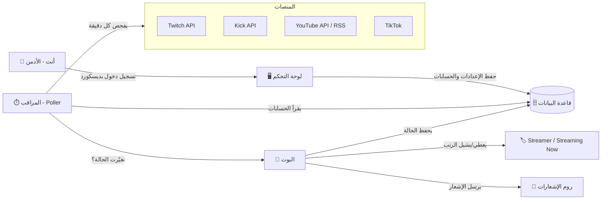
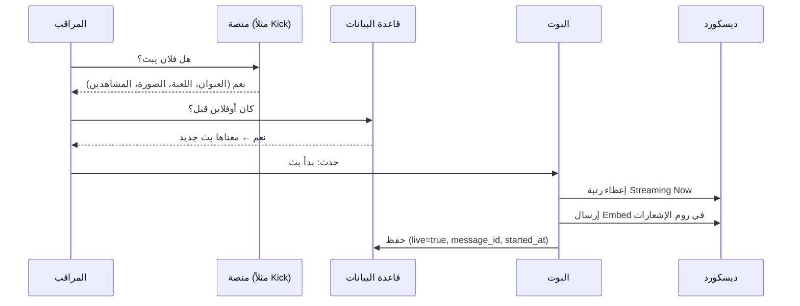
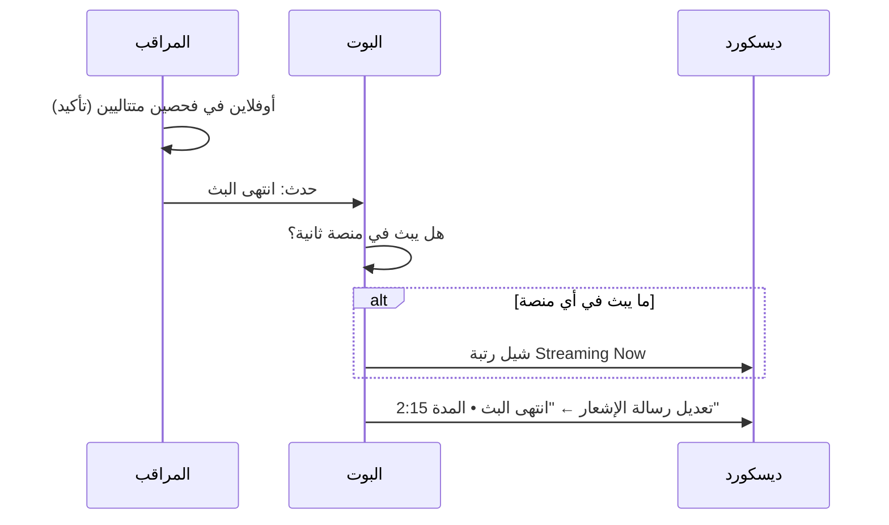
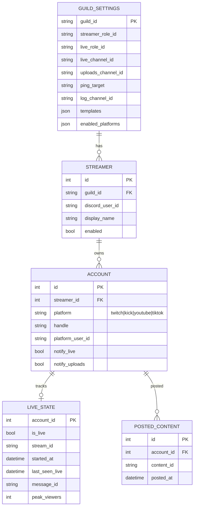

# 🎥 Workspace — بوت البثوث (Stream Bot)

> **الحالة:** 📝 مرحلة التخطيط فقط. ما راح يبدأ التنفيذ إلا لما تقول "سوّ البوت".
> **آخر تحديث:** 2026-10-03

---

## 1. ملخص الفكرة

بوت ديسكورد عام للبثوث، يتابع حسابات أعضاء السيرفر على **Twitch** و **Kick** و **TikTok** و **YouTube**، ومعه **لوحة تحكم ويب** خاصة فيك.

**كيف يشتغل باختصار:**

1. أنت (الأدمن) تدخل لوحة التحكم وتحط **ID الرتب** اللي عندك أصلاً:
   - رتبة **Streamer** (الستريمر)
   - رتبة **Streaming Now** (يبث الحين)
2. تضيف الستريمر بالـ **Discord ID** حقه، وتربط حساباته بنفسك (حساب كيك، تويتش، تيك توك، يوتيوب).
3. أول ما تضيفه، البوت **يعطيه رتبة Streamer تلقائياً**.
4. البوت يراقب حساباته طول الوقت:
   - **إذا بدأ بث** ← يعطيه رتبة **Streaming Now** + يرسل **إشعار بث** في روم الإشعارات.
   - **إذا خلّص البث** ← يشيل منه رتبة **Streaming Now** (ويعدّل رسالة الإشعار إن البث انتهى).
   - **إذا نزّل مقطع جديد** (يوتيوب / تيك توك / ...) ← يرسل **إشعار مقطع** في الروم.
5. كل الإعدادات (الرتب، الرومات، نص الرسائل، الحسابات) تتعدل من لوحة التحكم بدون ما تلمس الكود.

---

## 2. المخطط العام



### تسلسل "بدأ البث"



### تسلسل "خلّص البث"



---

## 3. المنصات وطريقة المراقبة

| المنصة | البث المباشر | المقاطع الجديدة | الطريقة | الموثوقية |
|---|---|---|---|---|
| **Twitch** | ✅ | ✅ (VODs / Highlights / Clips اختياري) | Helix API الرسمي (`/streams`, `/videos`) — يفحص لين 100 حساب بطلب واحد. لاحقاً ممكن EventSub (Webhooks) | 🟢 ممتازة |
| **YouTube** | ✅ | ✅ (فيديو + شورتس) | RSS الخاص بالقناة (مجاني) + `videos.list` (وحدة وحدة من الكوتا) لمعرفة إذا لايف. لاحقاً WebSub للإشعار الفوري | 🟢 ممتازة |
| **Kick** | ✅ | ⚠️ محدود | Kick Public API الرسمي (`api.kick.com`) + Webhooks لحالة البث | 🟡 جيدة |
| **TikTok** | ⚠️ | ⚠️ | ما فيه API رسمي عام للايف. نستخدم مكتبة غير رسمية (مثل `tiktok-live-connector`) لفحص اللايف، والمقاطع عن طريق صفحة الحساب | 🔴 ممكن تنكسر لو تيك توك غيّر شي |

> ⚠️ **ملاحظة مهمة عن تيك توك:** هو أضعف منصة تقنياً. بنسويه كـ "تجريبي" ونخلي البوت ما يطيح لو تيك توك فشل — بس يسجل خطأ في اللوق ويكمل باقي المنصات.

**فترات الفحص المقترحة (تتعدل من اللوحة):**

| المنصة | بث مباشر | مقاطع |
|---|---|---|
| Twitch | كل 60 ثانية | كل 5 دقايق |
| Kick | كل 60 ثانية | — |
| YouTube | كل 2–3 دقايق | كل 5 دقايق |
| TikTok | كل 2–3 دقايق | كل 10 دقايق |

---

## 4. منطق الرتب (Roles)

| الرتبة | متى تنعطى | متى تنشال |
|---|---|---|
| **Streamer** | لما الأدمن يضيف العضو في اللوحة (ويكون عنده حساب واحد على الأقل) | لما الأدمن يحذفه من اللوحة |
| **Streaming Now** | لما يبدأ بث في **أي** منصة | لما يكون أوفلاين في **كل** المنصات |

**قواعد مهمة:**

- 🛡️ **فترة سماح:** ما نشيل رتبة Streaming Now إلا بعد ما يكون أوفلاين في فحصين متتاليين (عشان لو النت قطع عند الستريمر دقيقة ما يصير سبام رتب وإشعارات).
- 🔁 **منع تكرار الإشعار:** لو البث طاح ورجع خلال 10 دقايق (قابل للتعديل) ← ما يرسل إشعار جديد، يكمل على نفس الرسالة.
- 🔄 **مزامنة عند التشغيل:** أول ما البوت يشتغل، يفحص الكل ويصلّح الرتب (يشيل Streaming Now من اللي مو لايف، ويعطيها للي لايف).
- ⚙️ **شرط تقني:** رتبة البوت لازم تكون **فوق** رتبتي Streamer و Streaming Now في ترتيب الرتب، وعنده صلاحية **Manage Roles**. اللوحة بتنبهك لو هالشي مو مضبوط.

---

## 5. لوحة التحكم (Dashboard)

**الدخول:** تسجيل دخول بحساب ديسكورد (OAuth2). يدخل بس اللي عنده صلاحية **Manage Server** أو IDs أنت تحددها.
**الواجهة:** عربي (RTL) + دعم إنجليزي لاحقاً.

### الصفحات

#### 🏠 الرئيسية
- مين يبث الحين (بطاقات مباشرة: الاسم، المنصة، المشاهدين، مدة البث)
- آخر الإشعارات اللي انرسلت
- حالة البوت والمنصات (🟢 شغال / 🔴 فيه مشكلة)

#### ⚙️ الإعدادات العامة
| الحقل | مثال |
|---|---|
| ID رتبة Streamer | `123456789012345678` |
| ID رتبة Streaming Now | `123456789012345679` |
| روم إشعارات البث | `#live-now` |
| روم إشعارات المقاطع | `#new-videos` (أو نفس روم البث) |
| المنشن مع الإشعار | لا شي / `@everyone` / `@here` / رتبة معيّنة |
| روم اللوق (اختياري) | `#bot-logs` |
| تفعيل/تعطيل كل منصة | ✅ Twitch ✅ Kick ✅ YouTube ⬜ TikTok |

> اللوحة تتحقق إن الـ ID صحيح وموجود في السيرفر، وتعرض اسم الرتبة/الروم جنبه.

#### 👥 الستريمرز
- جدول بكل الستريمرز: الصورة، الاسم، الحسابات المربوطة، الحالة (لايف/أوفلاين)
- زر **إضافة ستريمر**:
  1. تحط **Discord ID** حقه (أو تختاره من قائمة الأعضاء)
  2. تحط حساباته:
     - Twitch: `username`
     - Kick: `username`
     - TikTok: `@username`
     - YouTube: رابط القناة أو `@handle`
  3. لكل حساب: ✅ إشعار البث ✅ إشعار المقاطع
  4. حفظ ← البوت يتأكد إن الحسابات موجودة فعلاً + يعطيه رتبة Streamer
- تعديل / إيقاف مؤقت / حذف

#### 💬 قوالب الرسائل
- تعديل نص الإشعار ولون الـ Embed لكل نوع (بث / مقطع) ولكل منصة
- متغيرات جاهزة: `{user}` `{mention}` `{platform}` `{title}` `{game}` `{url}` `{viewers}`
- **معاينة مباشرة** للرسالة قبل الحفظ
- زر "إرسال تجربة" للروم

#### 📜 السجل (Logs)
- كل حدث: مين بدأ بث، مين انعطى/انشال منه رتبة، أخطاء المنصات

---

## 6. شكل الإشعارات

**إشعار بث (مثال):**
```
🔴 فلان بدأ بث على Kick!
┌───────────────────────────────┐
│ 🎮 العنوان: رانكد فالورانت 🔥     │
│ 📂 القسم: VALORANT              │
│ 👀 المشاهدين: 152               │
│ [صورة البث المصغّرة]            │
└───────────────────────────────┘
[ 📺 شاهد البث ]  ← زر
```

**بعد ما يخلّص (نفس الرسالة تتعدل):**
```
⚫ انتهى البث • المدة: 2 ساعة 15 دقيقة • أعلى مشاهدين: 310
```

**إشعار مقطع:**
```
🎬 فلان نزّل مقطع جديد على YouTube!
"أقوى لقطات الأسبوع"
[صورة المقطع]   [ ▶️ شاهد ]
```

---

## 7. التقنيات المقترحة

| الجزء | التقنية | ليش |
|---|---|---|
| البوت | **Node.js + discord.js v14** | الأشهر والأقوى لبوتات ديسكورد |
| اللوحة (Backend) | **Express** (في نفس المشروع) | بسيط ويشارك نفس قاعدة البيانات مع البوت |
| اللوحة (Frontend) | **React + Vite + Tailwind** | واجهة حديثة وسريعة وتدعم RTL |
| قاعدة البيانات | **SQLite** (عن طريق Prisma) | ملف واحد، ما يحتاج سيرفر، وسهل ننقل لـ PostgreSQL لاحقاً |
| تسجيل الدخول | **Discord OAuth2** | تدخل بحساب ديسكورد مباشرة |
| التشغيل | **Docker** + VPS (أو Railway) | تشغيل 24/7 |

### هيكل المجلدات المقترح

```
stream-bot/
├── src/
│   ├── bot/
│   │   ├── client.js          # تشغيل البوت
│   │   ├── roles.js           # إعطاء/سحب الرتب
│   │   ├── notifier.js        # إرسال وتعديل الإشعارات
│   │   └── commands/          # أوامر سلاش (/live, /streamer ...)
│   ├── platforms/
│   │   ├── index.js           # واجهة موحّدة لكل المنصات
│   │   ├── twitch.js
│   │   ├── kick.js
│   │   ├── youtube.js
│   │   └── tiktok.js
│   ├── scheduler/
│   │   └── poller.js          # الفحص الدوري ومقارنة الحالة
│   ├── dashboard/
│   │   ├── server.js          # Express API
│   │   ├── auth.js            # Discord OAuth2
│   │   └── routes/
│   ├── db/
│   │   └── schema.prisma
│   └── config.js
├── dashboard-ui/              # واجهة React
├── .env.example
├── Dockerfile
└── package.json
```

### الواجهة الموحدة للمنصات

كل منصة تطبّق نفس الدالتين، عشان نضيف أي منصة جديدة مستقبلاً بسهولة:

```js
// يرجع حالة البث لكل حساب
checkLive(accounts) → [{ accountId, isLive, title, category, thumbnail, viewers, url, startedAt }]

// يرجع آخر المقاطع
fetchLatestContent(account) → [{ contentId, type, title, url, thumbnail, publishedAt }]
```

---

## 8. قاعدة البيانات (مبدئياً)



---

## 9. خطة التنفيذ (مراحل)

| # | المرحلة | المحتوى | الناتج |
|---|---|---|---|
| 0 | **التجهيز** | إنشاء المشروع، ملف `.env`، تطبيق ديسكورد، قاعدة البيانات | مشروع فاضي يشتغل |
| 1 | **البوت الأساسي** | تشغيل البوت، منطق الرتب، نظام الإشعارات، أوامر سلاش للإدارة كبديل للوحة | بوت يعطي رتب يدوياً |
| 2 | **Twitch + YouTube** | المراقبة الدورية + إشعارات البث والمقاطع | أول منصتين شغالين |
| 3 | **Kick** | الربط بـ Kick API | ثالث منصة |
| 4 | **TikTok (تجريبي)** | مكتبة غير رسمية + حماية من الأعطال | رابع منصة |
| 5 | **لوحة التحكم** | تسجيل الدخول، الإعدادات، الستريمرز، القوالب، السجل | لوحة كاملة |
| 6 | **التحسينات** | فترة السماح، منع التكرار، المزامنة عند التشغيل، تعديل الرسالة بعد البث | بوت مستقر |
| 7 | **النشر** | Docker + تشغيل 24/7 + دليل تشغيل | البوت أونلاين |

---

## 10. أفكار إضافية 💡 (اختر اللي يعجبك)

| # | الفكرة | الوصف |
|---|---|---|
| 1 | **إشعار موحّد للبث المتعدد** | لو فلان يبث على كيك وتويتش بنفس الوقت ← رسالة وحدة فيها زرين بدل رسالتين |
| 2 | **ملخص بعد البث** | تعديل الرسالة بعد البث: المدة، أعلى مشاهدين، الأقسام اللي لعبها |
| 3 | **رتبة "إشعارات البثوث" اختيارية** | زر في روم معيّن، العضو يضغطه عشان يجيه منشن مع كل بث (بدل @everyone المزعج) |
| 4 | **رتب حسب المنصة** | رتبة Kick Streamer، رتبة Twitch Streamer... بالإضافة للرتبة العامة |
| 5 | **لوحة صدارة شهرية** | أكثر ستريمر بث ساعات هالشهر (أمر `/top` + صفحة في اللوحة) |
| 6 | **أمر `/live`** | يعرض مين يبث الحين في السيرفر |
| 7 | **رسالة مخصصة لكل ستريمر** | كل ستريمر له نص إشعار ولون خاص فيه |
| 8 | **روم مختلف لكل منصة** | إشعارات كيك في روم، يوتيوب في روم ثاني |
| 9 | **جدول البثوث** | الستريمر يحط جدوله (`/schedule`) والبوت يذكّر قبل البث بربع ساعة |
| 10 | **كشف بث ديسكورد** | لو العضو حالته "Streaming" في ديسكورد نفسه ← يعطيه الرتبة حتى لو حسابه مو مضاف (اختياري) |
| 11 | **روم صوتي يعرض العدد** | اسم روم يتحدث تلقائياً: `🔴 يبثون الحين: 3` |
| 12 | **تقديم طلب ستريمر** | العضو يقدّم طلب من زر في الديسكورد بحساباته، وأنت توافق/ترفض من اللوحة بضغطة |
| 13 | **فلترة المقاطع** | تختار: الشورتس نعم/لا، كليبات تويتش نعم/لا |
| 14 | **أكثر من سيرفر** | البوت يشتغل في أكثر من سيرفر وكل سيرفر له إعداداته (مستقبلاً) |

---

## 11. وش أحتاج منك قبل التنفيذ ✅

### مفاتيح وحسابات (تجهزها أنت، وأنا أشرح لك الطريقة خطوة بخطوة وقت التنفيذ)
- [ ] **Discord:** Bot Token + Client ID + Client Secret (من Discord Developer Portal)
- [ ] **Twitch:** Client ID + Client Secret (من dev.twitch.tv)
- [ ] **YouTube:** API Key (من Google Cloud Console)
- [ ] **Kick:** Client ID + Client Secret (من إعدادات المطوّر في كيك)
- [ ] **TikTok:** ما يحتاج مفتاح (غير رسمي)

### معلومات السيرفر (تنحط من اللوحة بعدين، بس جهّزها)
- [ ] ID رتبة Streamer
- [ ] ID رتبة Streaming Now
- [ ] ID روم إشعارات البث / المقاطع

### قرارات تحتاج تأكيدك
- [ ] **وين بتشغّل البوت؟** VPS / Railway / جهازك الشخصي؟ (اللوحة تحتاج رابط عام عشان تسجيل الدخول بديسكورد)
- [ ] **سيرفر واحد ولا أكثر؟**
- [ ] **المنشن مع الإشعار:** @everyone / @here / رتبة معيّنة / بدون؟
- [ ] **أي أنواع مقاطع تبي؟** (يوتيوب عادي + شورتس؟ كليبات تويتش؟ VODs؟)
- [ ] **أي أفكار من القسم 10 تبيها في النسخة الأولى؟**
- [ ] **لغة البرمجة:** Node.js (مقترح) ولا Python؟

---

## 12. المخاطر والقيود

| الخطر | الحل |
|---|---|
| تيك توك يغيّر موقعه وتنكسر المراقبة | نعزله كـ "تجريبي"، أي خطأ فيه ما يأثر على باقي المنصات، وسهل نحدّث المكتبة |
| كوتا يوتيوب (10,000 وحدة يومياً) | نستخدم RSS المجاني بدل البحث المكلف (البحث = 100 وحدة، الـ RSS = 0) |
| Rate limits من المنصات | فحص مجمّع (تويتش 100 حساب بطلب واحد) + فترات فحص معقولة |
| البوت يطفى ويرجع | مزامنة كاملة للرتب والحالة عند التشغيل |
| رتبة البوت تحت الرتب المطلوبة | تنبيه واضح في اللوحة + في روم اللوق |
| تسريب المفاتيح | كلها في `.env` وما تنرفع على GitHub أبداً |

---

> **الخطوة الجاية:** راجع الخطة، اختر الأفكار اللي تبيها، وجاوب على "القرارات اللي تحتاج تأكيدك" — وبعدها قل **"سوّ البوت"** ونبدأ بالمرحلة 0.
