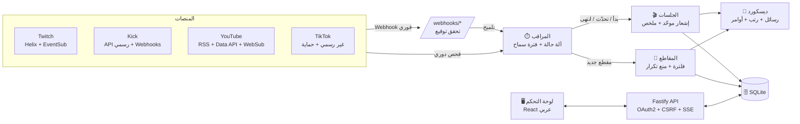

# 🎥 Workspace — بوت البثوث (Stream Bot)

> **الحالة:** ✅ **تم التنفيذ** — البوت + لوحة التحكم + النشر على VPS (Docker) جاهزين.
> **آخر تحديث:** 2026-10-03
> دليل التشغيل خطوة بخطوة في [README.md](README.md).

---

## 1. ملخص الفكرة

بوت ديسكورد للبثوث يتابع حسابات أعضاء السيرفر على **Twitch** و **Kick** و **TikTok** و **YouTube**، ومعه **لوحة تحكم ويب عربية** خاصة فيك:

1. تحط من اللوحة **ID رتبة Streamer** و **ID رتبة Streaming Now** (أو تختارها من قائمة).
2. تضيف الستريمر بالـ **Discord ID** حقه وتحط حساباته بنفسك (كيك، تويتش، تيك توك، يوتيوب) — اللوحة تتحقق من كل حساب.
3. أول ما تضيفه ← ياخذ رتبة **Streamer** تلقائياً.
4. **إذا بث** ← رتبة **Streaming Now** + إشعار في روم البثوث (**بدون منشن**).
5. **إذا خلّص** ← تنشال الرتبة والرسالة نفسها تتحول **لملخص**.
6. **إذا نزّل مقطع** ← إشعار في روم المقاطع.

---

## 2. القرارات المعتمدة

| القرار | الاختيار |
|---|---|
| الأفكار الإضافية في النسخة الأولى | **1** (إشعار موحّد للبث المتعدد) + **2** (ملخص بعد البث) |
| الاستضافة | **VPS** (Docker + Caddy لشهادة HTTPS تلقائية) |
| المنشن مع الإشعار | **بدون منشن** (قابل للتغيير من اللوحة) |
| أنواع المقاطع | **كل شي**: يوتيوب (فيديو + شورتس + إعادة البث)، تيك توك، تويتش (VOD + هايلايت + أبلود + كليبات)، كيك |
| اللغة | **Node.js + TypeScript** |
| عدد السيرفرات | سيرفر واحد، والتصميم يدعم أكثر من سيرفر |

---

## 3. المخطط النهائي

### كيف يتعامل مع كل منصة (بعد البحث والتحقق)

| المنصة | البث المباشر | المقاطع | ملاحظات |
|---|---|---|---|
| **Twitch** | ✅ رسمي: Get Streams (100 حساب بطلب) + EventSub فوري | ✅ VOD / هايلايت / أبلود / كليبات | يحتاج 3 فحوصات أوفلاين متتالية لأن كاش تويتش أحياناً يخفي بث شغّال |
| **Kick** | ✅ رسمي: `/users/livestreams` + Webhooks موقّعة RSA | ⚠️ ما فيه API رسمي — زر "الإعادات" في الملخص (والطريقة غير الرسمية اختيارية) | شروط كيك تمنع السحب الآلي، فما نخاطر بتطبيقك |
| **YouTube** | ✅ RSS مجاني + `videos.list` بدفعات (كوتا قليلة جداً) + WebSub | ✅ فيديو / شورتس / إعادة بث / بريمير | عدّاد كوتا يومي، بدون أي scraping (سياسة يوتيوب) |
| **TikTok** | ⚠️ غير رسمي: api-live + room/info + صفحة اللايف | ⚠️ صفحة Embed الرسمية + RSSHub احتياطي | قاطع دائرة لو تيك توك حجب، يتجاهل الظهور كضيف، الصور ترتفع كمرفق |

---

## 4. اللي تم تنفيذه

### البوت
- [x] رتبة **Streamer** تلقائية عند الإضافة، وتنشال عند الحذف (قابل للتعطيل)
- [x] رتبة **Streaming Now** وقت البث في أي منصة، وتنشال لما يطفي كل المنصات
- [x] **إشعار موحّد** (فكرة 1): رسالة وحدة فيها زر لكل منصة يبث عليها
- [x] **تحديث حي** للرسالة (مشاهدين، عنوان، لعبة) مع حد للتعديلات
- [x] **ملخص بعد البث** (فكرة 2): المدة، أعلى/متوسط مشاهدين (موزون بالوقت)، الألعاب مع وقت كل لعبة، روابط الإعادة لكل منصة (ويعيد البحث عنها بعد 4 و15 دقيقة)
- [x] **دمج إعادة الاتصال**: لو رجع خلال 10 دقايق تكمل نفس الرسالة
- [x] **فترة سماح** ضد انقطاع النت + قفل لكل ستريمر يمنع رسالتين لو بدأ على منصتين بنفس اللحظة
- [x] **إشعارات المقاطع** لكل المنصات، بدون إغراق بالمقاطع القديمة أول مرة
- [x] بدون منشن افتراضياً، وأي `@everyone` في عنوان بث ما يمنشن أحد
- [x] أوامر سلاش: `/live`، `/streamer add|remove|list|info`، `/bot status|sync|test`
- [x] تشخيص: يكتشف لو رتبة البوت تحت الرتب أو ناقصه صلاحيات ويشرح الحل بالعربي
- [x] يتحمل الأعطال: يعيد الاتصال بديسكورد تلقائياً، ويزامن الرتب والجلسات بعد إعادة التشغيل

### لوحة التحكم (عربي RTL، تصميم داكن)
- [x] تسجيل دخول بديسكورد (OAuth2) — للي عندهم Manage Server أو IDs محددة
- [x] **نظرة عامة**: مين يبث الحين (تحديث لحظي)، تنبيهات المشاكل مع الحل، آخر الجلسات والمقاطع
- [x] **الستريمرز**: إضافة بالـ ID مع تحقق فوري من العضو ومن كل حساب (صورة + اسم)
- [x] **الإعدادات**: الرتب والرومات (كتابة ID أو اختيار من القائمة)، المنشن، المنصات، أنواع المقاطع، الخيارات
- [x] **الرسائل**: محرر قوالب مع معاينة شكل ديسكورد + إرسال تجربة
- [x] **السجل**: كل الجلسات مع الملخص + لوحة صدارة (7/30 يوم)
- [x] **النشاط** و **الحالة** (صحة كل منصة، آخر فحص ناجح، الأخطاء)

### البنية
- [x] Docker + Caddy (HTTPS تلقائي) + سكربت نسخ احتياطي
- [x] أكثر من 700 اختبار آلي (السيرفر + اللوحة) — كلها ناجحة
- [x] مراجعة مستقلة من زوايا متعددة (تدفقات، أمان، تزامن، المنصات، ديسكورد/اللوحة)

---

## 5. اختيارات للمرحلة الجاية 💡

اختر اللي تبيه وأضيفه:

| # | الفكرة | الوصف |
|---|---|---|
| 1 | **رتبة إشعارات اختيارية** | زر في روم، العضو يضغطه وياخذ رتبة "إشعارات البثوث" وينمنشن مع كل بث (بدل @everyone) |
| 2 | **لوحة صدارة في ديسكورد** | أمر `/top` + رسالة شهرية تلقائية بأكثر ستريمر بث ساعات |
| 3 | **رتب حسب المنصة** | Kick Streamer / Twitch Streamer... بالإضافة للرتبة العامة |
| 4 | **روم لكل منصة أو نوع محتوى** | كيك في روم، يوتيوب في روم، الكليبات في روم لحالها |
| 5 | **رسالة ولون خاص لكل ستريمر** | كل ستريمر له قالب ولون يميزه |
| 6 | **فلاتر الكليبات** | أقل عدد مشاهدات / المميزة فقط / ملخص كليبات يومي بدل رسالة لكل كليب |
| 7 | **جدول البثوث + تذكير** | `/schedule` والبوت يذكّر قبل البث بربع ساعة |
| 8 | **روم صوتي بالعداد** | اسم روم يتحدث تلقائياً: `🔴 يبثون الحين: 3` |
| 9 | **طلب ستريمر** | العضو يقدّم بحساباته من زر، وأنت توافق أو ترفض من اللوحة |
| 10 | **رسائل صامتة** | الإشعارات توصل بدون صوت تنبيه للأعضاء |
| 11 | **ربط رسمي للستريمر** | زر "اربط حسابك" (Twitch/TikTok) — أدق وأسرع ومتوافق أكثر مع سياسات المنصات |
| 12 | **Euler Stream لتيك توك** | تنبيه لايف فوري وأدق (مجاني لـ 5 ستريمرز) |
| 13 | **إحصائيات متقدمة** | رسم بياني للمشاهدين لكل بث + صفحة خاصة لكل ستريمر في اللوحة |
| 14 | **نشر مقطع كيك يدوي** | تلصق رابط مقطع كيك من اللوحة/أمر والبوت ينشره بنفس الشكل |
| 15 | **كشف بث ديسكورد** | لو حالة العضو "Streaming" في ديسكورد ياخذ الرتبة حتى لو حسابه مو مضاف |
| 16 | **اللوحة بالإنجليزي** | دعم لغتين في اللوحة والرسائل |
